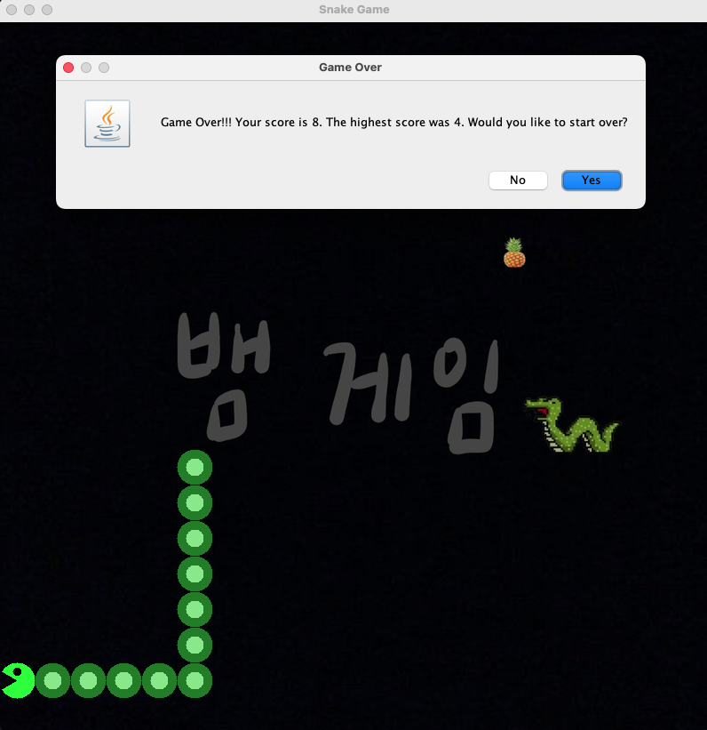

:snake: 貪吃蛇遊戲
===

介紹
---
這款遊戲沿用你熟悉的經典貪吃蛇玩法——每次吃到水果，蛇身就會變長。但只要不小心撞到自己的身體或牆壁，遊戲就會立刻結束。
下載連結
---
[遊戲下載點](https://drive.google.com/drive/folders/13U5MFBYBYRKDpuSPCnkBTPcvFVTklfVG?usp=sharing)

[JDK下載點](https://www.oracle.com/java/technologies/downloads/)

    備註:
    請點擊「遊戲下載點」取得遊戲的JAR檔案。本遊戲需要JDK才能執行，請先確認你的電腦已安裝JDK。若尚未安裝，
    請先下載並安裝與作業系統相容的版本，之後再執行遊戲。
    
技術堆疊
---

* 後端:`Java(Swing for UI)`

使用者介面
---

    
#### 初始畫面:

#### 遊戲結束畫面:

