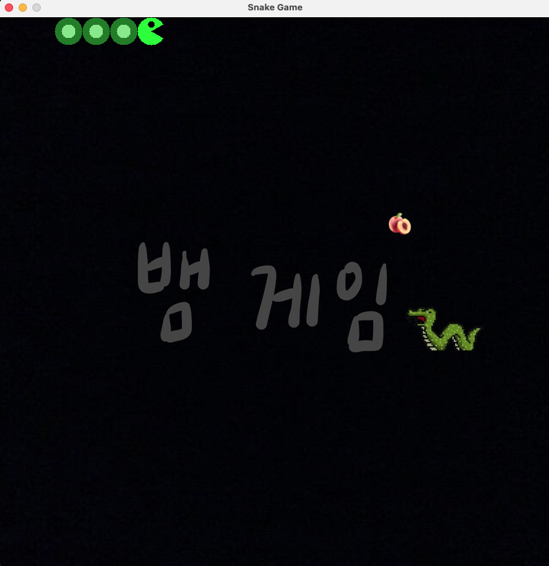

:snake: 뱀 게임
===

소개
---
이 게임은 익숙한 클래식 밤 게임 방식으로 진행됩니다. 뱀이 과일을 먹을 때마다 몸이 길어지지만, 자기 몸에 부딪히거나 벽에 충돌하면 즉시 게임이 끝납니다.

다운로드
---
[게임 다운로드받기](https://drive.google.com/drive/folders/13U5MFBYBYRKDpuSPCnkBTPcvFVTklfVG?usp=sharing)

[JDK 다운로드받기](https://www.oracle.com/java/technologies/downloads/)

    참고:
    위의 ‘게임 다운로드받기’를 클릭해 게임의 JAR 파일을 받으세요. 이 게임을 실행하려면 JDK가 필요합니다. 
    아직 설치하지 않았다면 제공된 링크에서 운영체제에 맞는 JDK 버전을 내려받아 설치한 뒤 게임을 실행하세요.
    
기술 스택
---

* 백엔드:`Java(Swing for UI)`

사용자 인터페이스
---

    
#### 홈 페이지:

#### 게임 오버:

