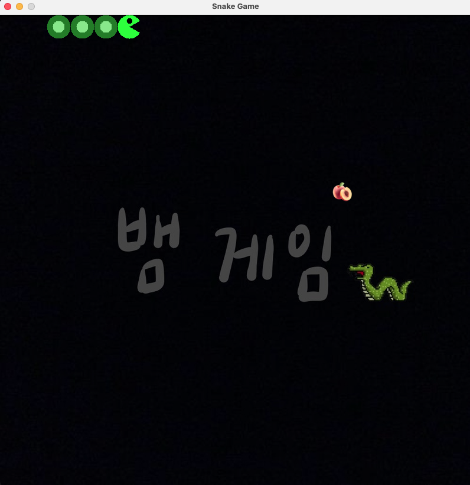
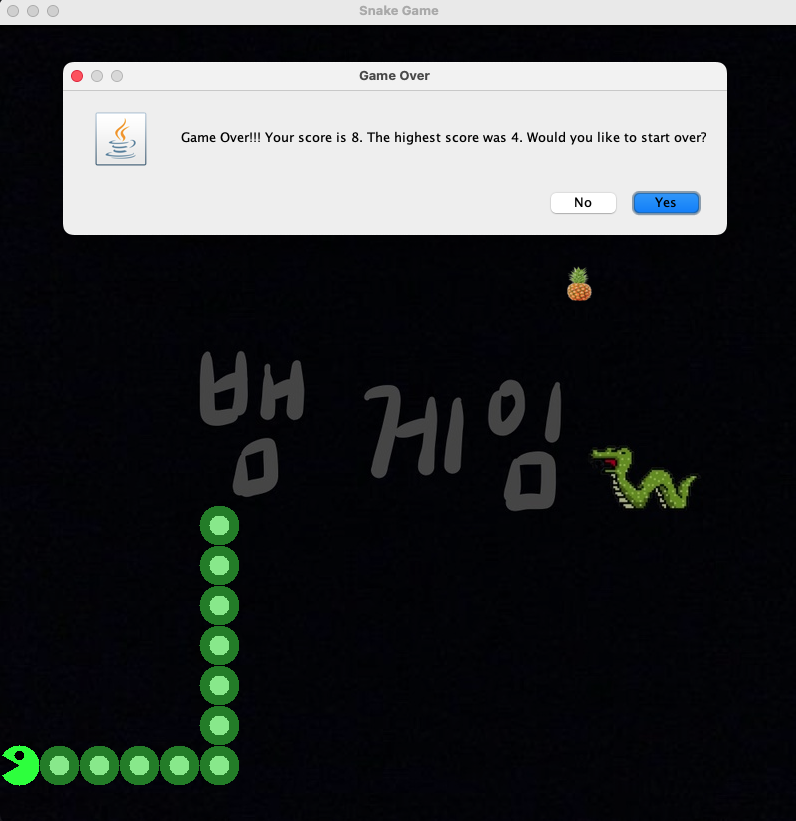

:snake: Snake Game
===

Introduction
---
This game follows the classic Snake gameplay you're familiar with—each time the snake eats a fruit, 
its body grows longer. However, if it accidentally runs into itself or crashes into a wall, 
the game will end immediately.

Download
---
[Link to Snake Game](https://drive.google.com/file/d/1yHLjJlKnsuRGpbOCM_hurpqdVXwAP5Ku/view?usp=sharing)

[Link to JDK](https://www.oracle.com/java/technologies/downloads/)

    Note:
    Please click the "download link" above to download the game's JAR file. Since this game requires JDK 
    to run, make sure you have it installed on your computer. If you don’t have JDK yet, please download 
    and install it from the link above before running the game. You can download any version of the JDK 
    that is compatible with your operating system.
    
Technology Stack
---

* Backend:`Java(Swing for UI)`

User Interface
---

    
#### Home Page:

#### Game Over:

